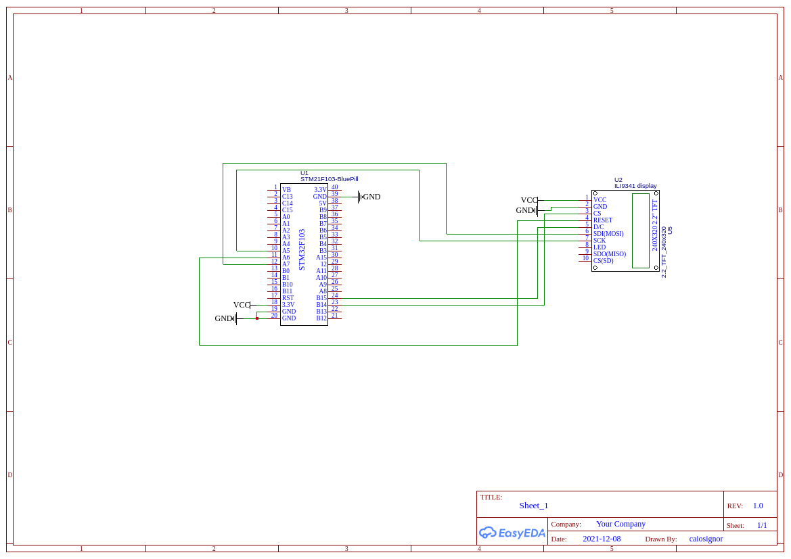

# STM32 Double Pendulum Simulation

This little project aims to exercise my skills with physics and object orientation programming in c++.

The project use an STM32F103 mcu to calculate the position of pendulums and draw it to a display (240x320) interfaced by SPI and ILI9341 display controller.

## Dependencies

[stm32-ili9341-drv](https://github.com/caiosignor/stm32-ili9341-drv) : ILI9341 SPI Driver for STM32. Forked from [STM32-ILI9341](https://github.com/martnak/STM32-ILI9341).

[hagl](https://github.com/tuupola/hagl) : A GFX Library for embedded systems.

[CMSIS-DSP](https://www.keil.com/pack/doc/CMSIS/DSP/html/index.html) : Use of sin and cos functions optimized to arm mcus.

## Schematics

## Runtime

(I promisse that low FPS Rate it's from mp4 to gif convesion..)

## Double Pedulum References
[My Physics lab](https://www.myphysicslab.com/pendulum/double-pendulum-en.html)

[Coding Challenge #93: Pêndulo Duplo](https://www.youtube.com/watch?v=uWzPe_S-RVE)
